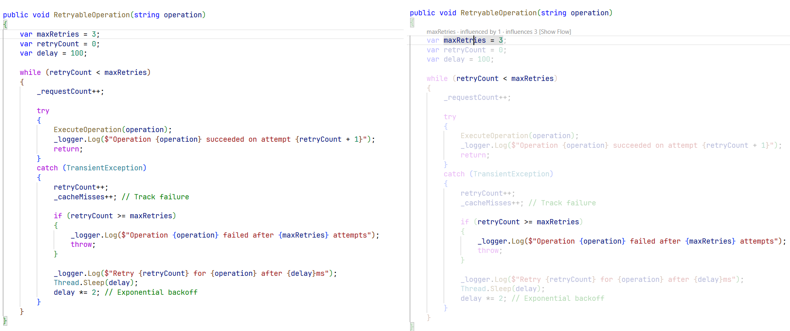
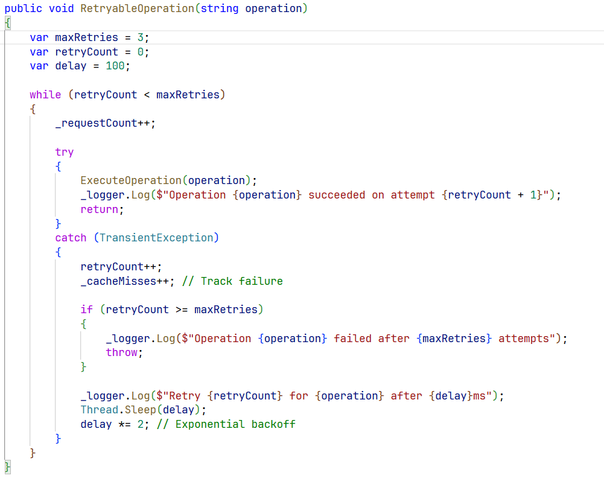
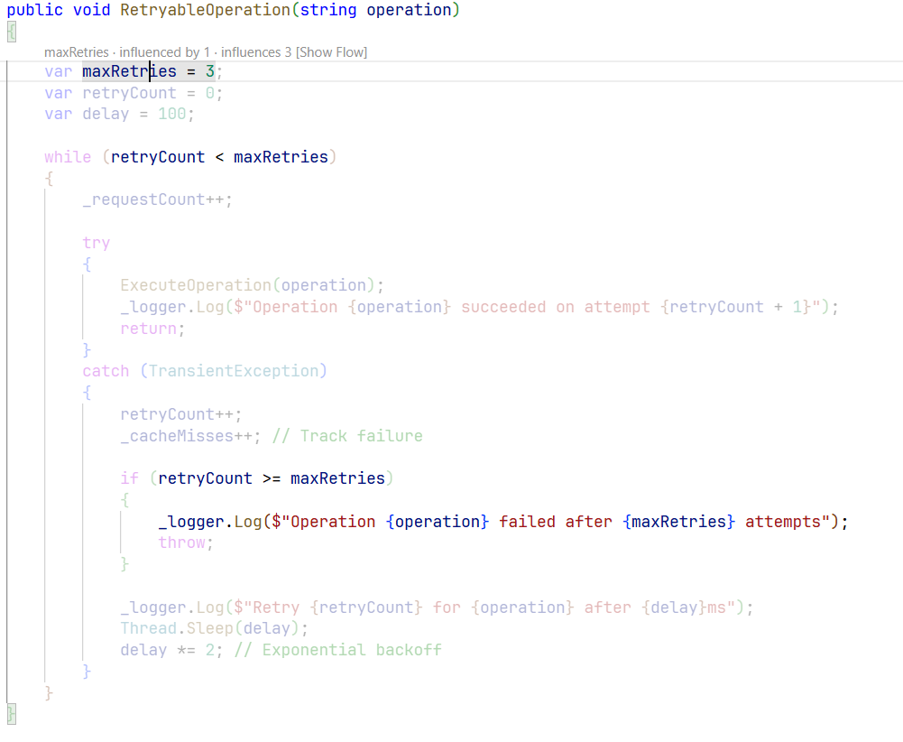
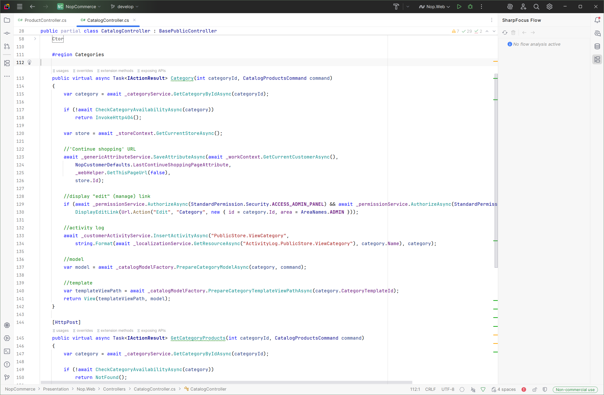
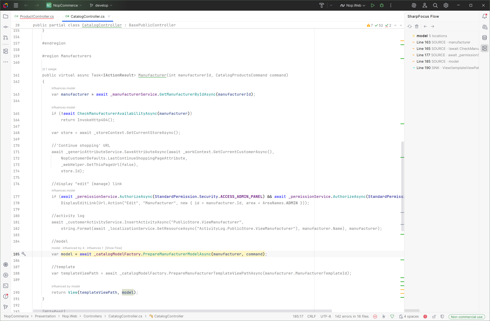
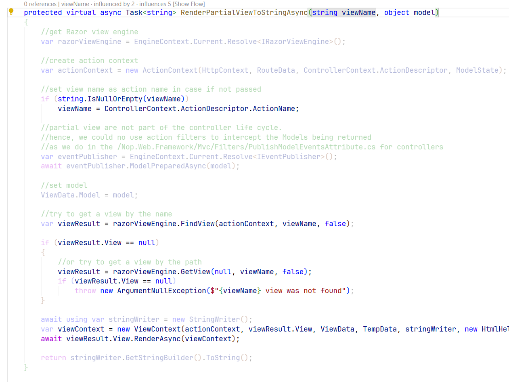
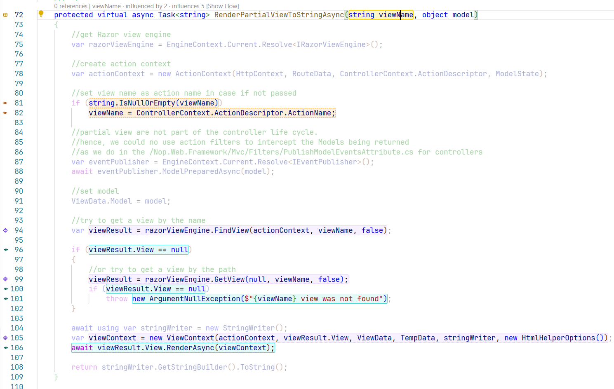
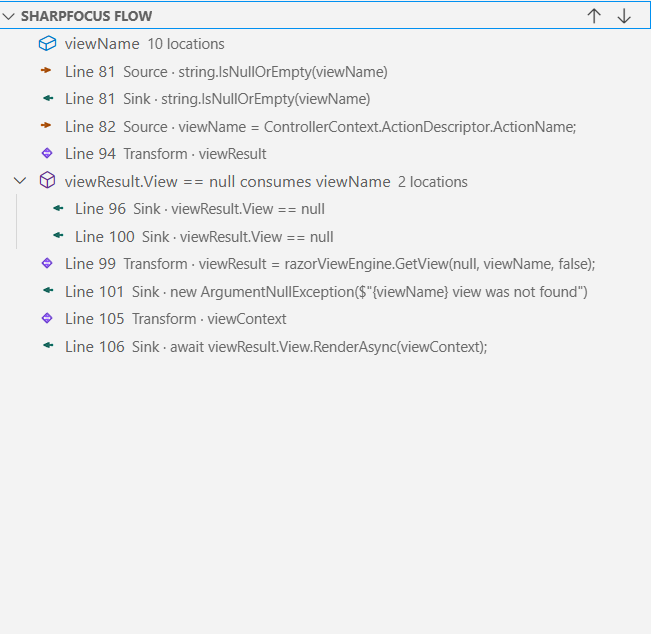

# SharpFocus

[](https://marketplace.visualstudio.com/items?itemName=RahulTR.sharpfocus)
[]([https://plugins.jetbrains.com/](https://plugins.jetbrains.com/plugin/28984-sharpfocus))
[](LICENSE)
[](https://dotnet.microsoft.com/)

**Information Flow Analysis for C# — Understand What Your Code Really Does**

SharpFocus brings information-flow analysis to VS Code and JetBrains Rider. Inspired by [Flowistry](https://github.com/willcrichton/flowistry) for Rust, it uses program slicing to help developers understand data dependencies and code relationships at a glance.



---

## What is SharpFocus?

SharpFocus implements **program slicing** — a static analysis technique that answers two critical questions about any variable in your code:

1. **Backward Slice:** What code could have influenced this variable?
2. **Forward Slice:** What code could be influenced by this variable?

By combining both directions, SharpFocus creates a **focus mode** that highlights only the relevant code paths, fading everything else away. Perfect for debugging, refactoring, and code review.

**Learn More:**
- [Part 1: Understanding Code Through Data Flow](https://www.rahultr.dev/posts/part1-getting-started/) — Introduction to program slicing
- [Part 2: The Analysis Engine](https://www.rahultr.dev/posts/part2-core-technology/) — How the dataflow analysis works
- [Part 3: Advanced Analysis Techniques](https://www.rahultr.dev/posts/part3-advanced-concepts/) — Transfer functions and performance

---

## Features

### Focus Mode
Click any variable, parameter, or field and see the complete dataflow instantly. Everything else fades away.

**VS Code:**


*Before:*


*After:*

**JetBrains Rider:**


*Before: Full code visibility*


*After: Focus mode with CodeVision hints*

### Display Modes

**Normal Mode** - Clean, minimalist Flowistry-style interface:



**Advanced Mode** - Detailed flow indicators with colored relations and gutter icons:



### Navigation
Navigate through your code's dataflow with keyboard shortcuts and visual aids:
- Tree view with hierarchical flow visualization
- CodeLens annotations at each step
- Quick pick menu for flow details
- Keyboard shortcuts: `Ctrl+Alt+N` (next) / `Ctrl+Alt+P` (previous)

**Tree View** shows all flow locations organized by type:



### Settings
- **Analysis Mode:** Focus on click, or manual trigger
- **Display Mode:** Normal (minimalist) or Advanced (detailed)
- **Server Path:** Custom language server location

---

## Installation

### VS Code
```bash
ext install RahulTR.sharpfocus
```

Or download from [VS Code Marketplace](https://marketplace.visualstudio.com/items?itemName=RahulTR.sharpfocus)

### JetBrains Rider
1. Open Rider → **Settings → Plugins**
2. Search for "SharpFocus"
3. Click **Install**

Or download from [JetBrains Marketplace](https://plugins.jetbrains.com/)

---

## Quick Start

1. Open a C# project
2. Click on any variable or parameter
3. Watch SharpFocus highlight the complete dataflow
4. Use `Ctrl+Alt+N` / `Ctrl+Alt+P` to navigate through flow locations

That's it! No configuration needed for basic usage.


---


## Development

### Prerequisites
- .NET 8.0+ SDK
- Node.js 20+ and npm (for VS Code extension)
- JDK 21 (for Rider plugin)

### Build

```bash
# Language server
dotnet build SharpFocus.sln

# VS Code extension
cd vscode-extension
npm install
npm run package

# Rider plugin
cd rider-plugin
.\gradlew buildPlugin
```

See [vscode-extension/README.md](vscode-extension/README.md) and [rider-plugin/README.md](rider-plugin/README.md) for detailed instructions.

---

## Roadmap

### Current (v0.1.0)
- ✅ Focus Mode with forward/backward slicing
- ✅ Normal and Advanced display modes
- ✅ VS Code and Rider support
- ✅ Intra-method analysis

### Planned
- 🔄 Cross-method analysis
- 🔄 Property and field tracking
- 🔄 Async/await support
- 🔄 LINQ query analysis
- 🔄 Performance improvements

---

## Acknowledgments

Inspired by [Flowistry](https://github.com/willcrichton/flowistry) for Rust. Built with [Roslyn](https://github.com/dotnet/roslyn).

---

## License

MIT License - see [LICENSE](LICENSE) file for details.

---

## Contributing

Contributions welcome! See individual extension/plugin READMEs for development setup.

---

**Made with ❤️ for C# developers**

Please ⭐ Star this repo if you find it useful!

---
